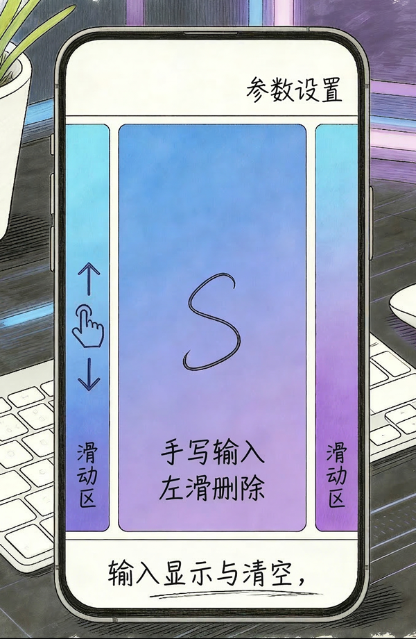

一款基于手势的本地搜索软件。使用手势搜索联系人，设置，软件。无需联网权限，放心食用。

最低安装要求：Android 14 (API 34)，原生 64 位 (arm64-v8a)

# 关于f和t识别错误的问题
Google 的 ML Kit 引擎是基于欧美用户的海量书写习惯训练的。由于底层 AI 模型不可修改，目前最有效的物理解决办法是：书写f 或者 t 的时候使用大写，或者尽量标准。尝试使用中文字典后，d不可避免的被识别成了o，所以暂时取消了中文引擎。
# 关于参数设置的搜索
谷歌从未提供过类似 getAllSettingsMenus() 的接口。安卓的“设置”本质上是一个包名为 com.android.settings 的普通 App，目前最大化了三星，小米，vivo，oppo的参数设置字典，但是也无法匹配所有的参数设置选项。

